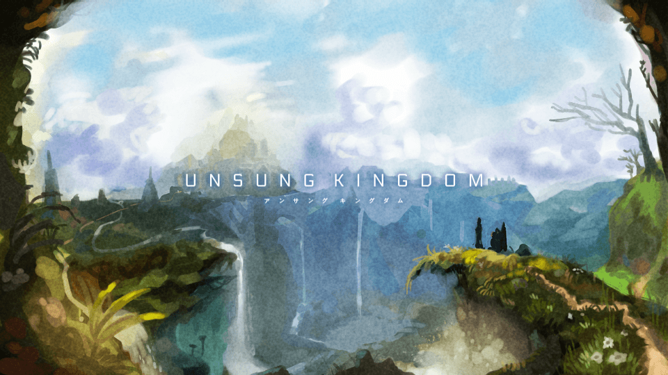
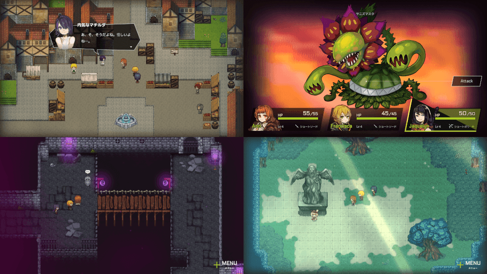

# Unsung Kingdom

Unsung Kingdom is an RPG made of JavaScript.

- [WebSite](https://unsungkingdom.laineus.com/)
- [Steam](https://store.steampowered.com/app/1344790/Unsung_Kingdom/)
- [GooglePlay](https://unsungkingdom.laineus.com/)

# Build

```
# prod
$ yarn install
$ yarn run build
```

```
# dev
$ yarn install
$ yarn run dev
```

# Debug Tips

You can click `M` key to activate debug features.
It is only works when `development` mode.
Also it doesn't works on Title screen.

One of them can load SampleSaveData (`/sample_save_data/*`).

# Contribute to translation

1. Make an issue and branch (if not yet opened for the language)
2. Make laguage files under `/src/locales/*` according to `/src/locales/ja`
3. Commit frequently to avoid conflict
4. The MR will be merged after translated all

If some people contributing for the language,
You should declare that which files you will translate in issue to avoid duplication.

# Contributers

English translations by [@uribgp](https://github.com/uribgp)

# Licence

This source code is able to use in MIT Licence.
Assets such as graphics, sounds and scenarios are not allowed to use.
